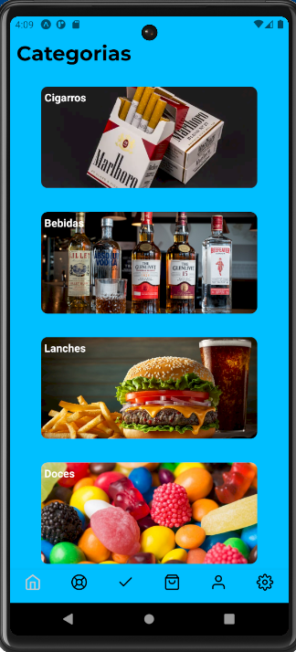
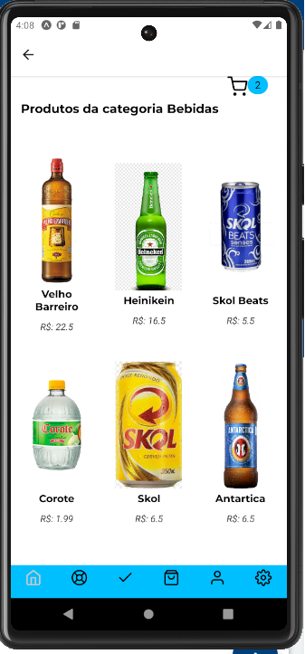
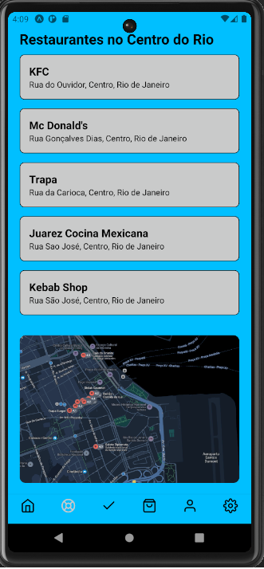

# InfnetFood

## O InfnetFood é uma simulação de um app Delivery para um trabalho da faculdade

# Funcionalidades

- **Navegação entre diversas telas**
- **Armazenamento do nome do usuário com AsyncStorage**
- **Tela de loading com animação**
- **Tela de Login**


## Tecnologias Utilizadas

- **React Native**
- **Expo**
- **React Navigation**
- **AsyncStorage**
- **Lottie**
- **Expo Google Fonts**

# Como rodar o projeto

1. **Clone este repositório**:
   ```bash
   git clone https://github.com/seuusuario/InfnetFood.git


2. **entre na pasta do projeto:**:
 ```bash
cd infnetfood
```

3. **Instale as dependências:**:
 ```bash
  npm install
```

4. **Inicie o projeto**:
 ```bash
  npx expo start
  ```


## Algumas imagens do projeto









  
